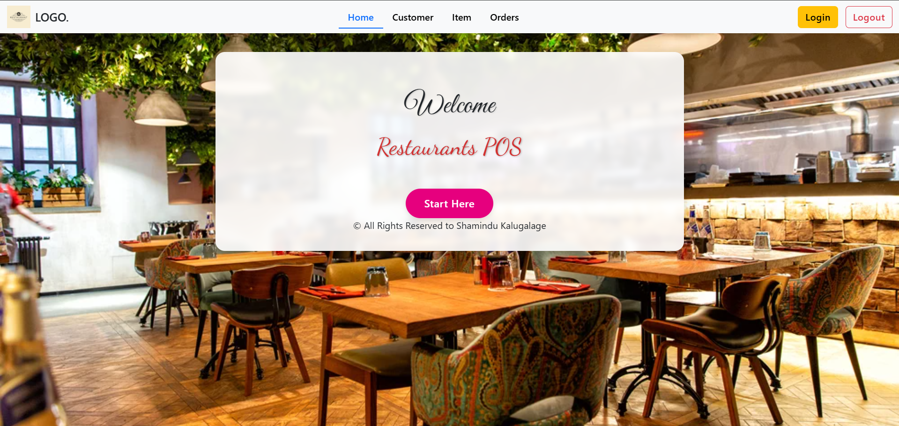
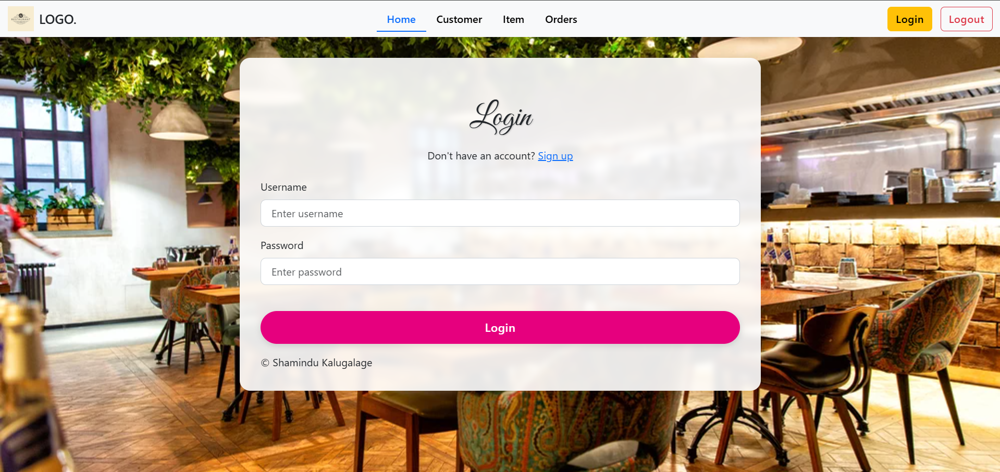
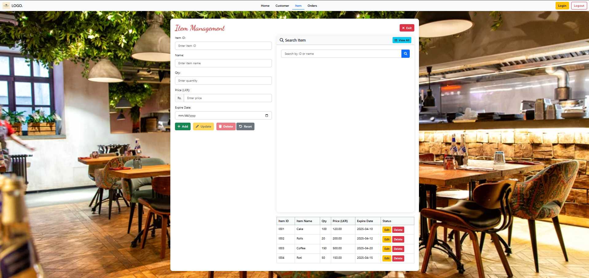
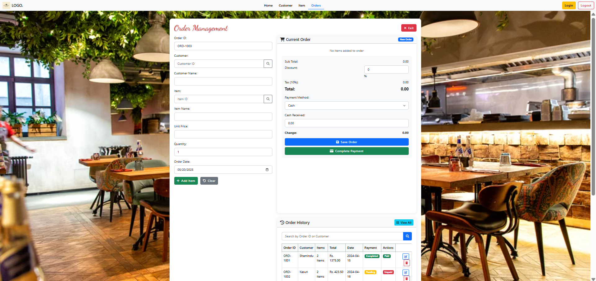

# Resturante-POS-System-MVC

[Site map](https://www.gloomaps.com/YKyf9gcto3)
[Wire frame](https://drive.google.com/file/d/1WQBlZMQVYtLuUJ89zye38bi-HCB7Ro-S/view?usp=sharing)
[Mock up](https://www.figma.com/design/V2mlomnaGFmGSEa5YA2k2F/Shamindu-POS-System?node-id=30-317&t=jK2bScaOrSZaBODg-1)

# Better Life Pharmacy System 💊

This project is a standalone JavaFX application designed for managing pharmacy operations including customers, medications, orders, and delivery.

## 📂 Features

- Customer Management
- Inventory Control
- Order Processing
- Delivery Tracking

## 🖼️ Project Screenshots 

### 📊 Home Page

### 🔐 Login Page

### 📊 Customer Page

### 📊 Item Page

### 📊 Order Page

## 🛠️ Technologies Used
- Java
- JavaFX
- Scene Builder
- MySQL

## 👨‍💻 Author
@ Shamindu Kalugalage
